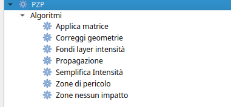
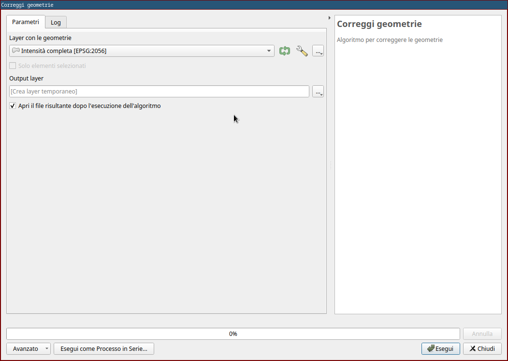
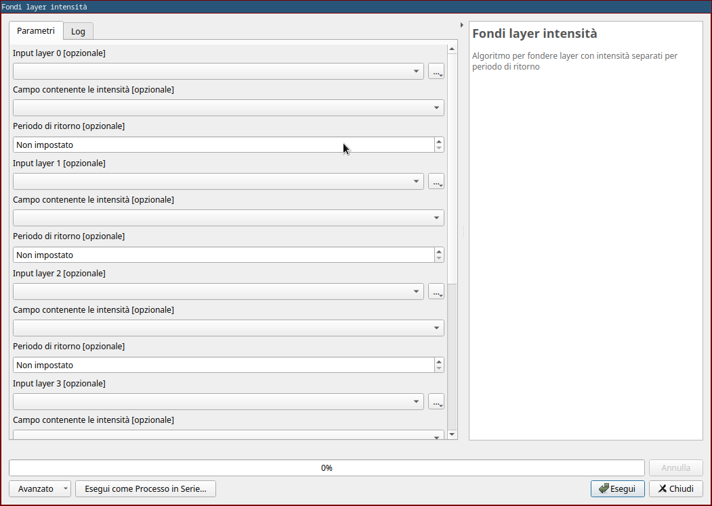
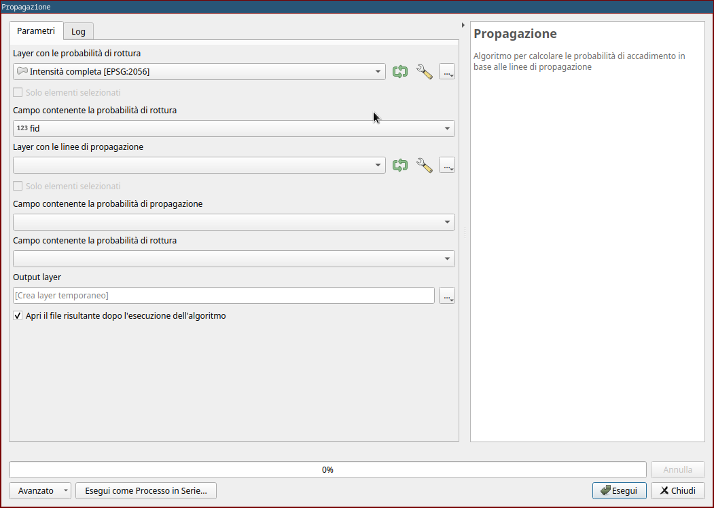
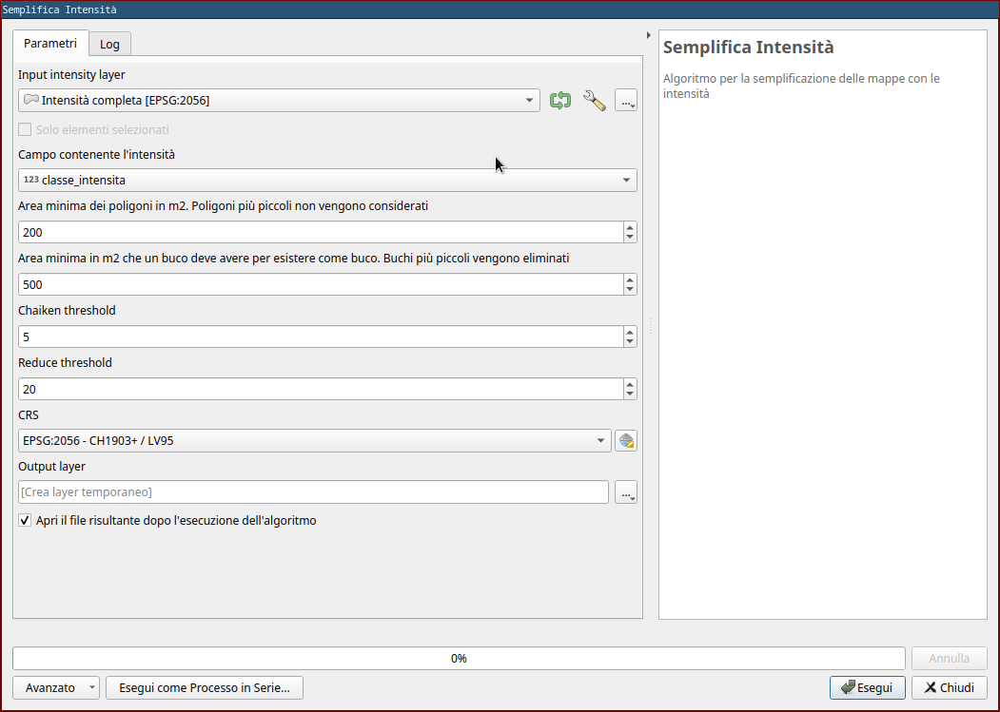
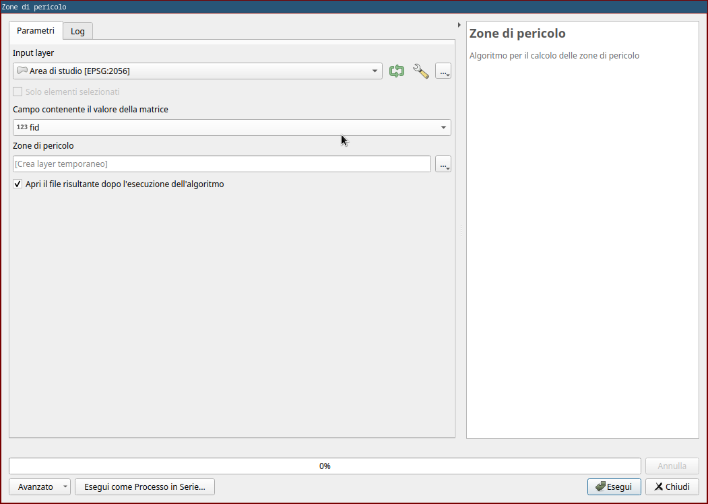
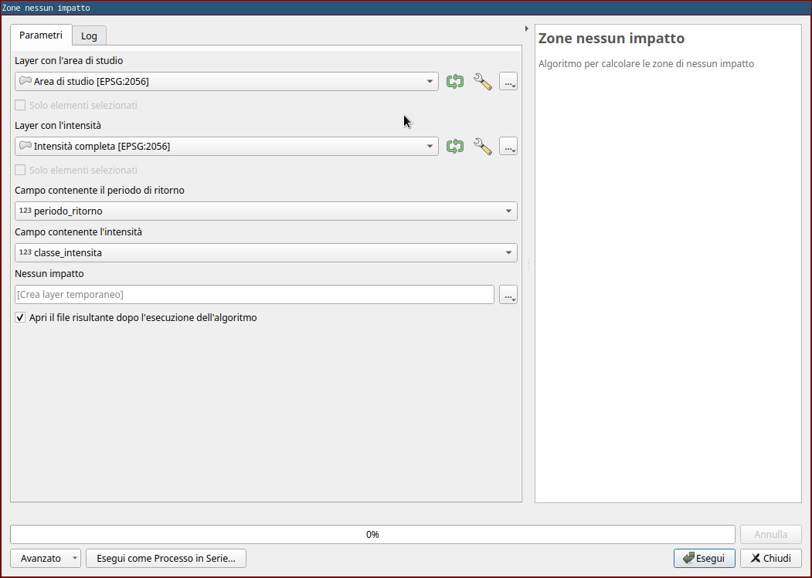

# Algoritmi

Gli algoritmi utilizzati dal plugin sono anche disponibili in QGIS
come "Algoritmi di Processing" utilizzabili singolarmente.

Gli algoritmi sono parte del plugin *pzp_utils* che é una dipendenza
del plugin *pzp* e se necessario può anche essere installato
individualmente.

## Applica matrice

### Scopo
Questo algoritmo aggiunge un campo con il valore della matrice a ogni geometria del layer con le intensità

### Parametri input
- Layer con le geometrie (intensità)
  - Campo contenente il periodo di ritorno
  - Campo contenente l'intensità
- Matrice da utilizzare (predefinita o manuale)

### Output
Viene generato un layer uguale al layer in ingresso con l'aggiunta di
un campo contenente il valore della matrice per ogni geometria.

## Correggi geometrie

### Scopo
Questo algoritmo cerca di correggere gli errori più frequenti di digitalizzazione delle geometrie.

### Parametri input
- Layer con le geometrie

### Ouptut
Viene generato un layer con le geometrie corrette mantenendo gli attributi delle geometrie iniziali.

Vengono eseguite in particolare eseguite le seguenti operazioni:

- Aggancia punti al reticolo (con reticolo di 1mm)
- Creazione e rimozione di un buffer negativo molto piccolo (1e-06 m) per rimuovere "sbavature" delle geometrie
- Rimozione delle aree con superficie inferiore a 1m2
- Rimozione dei buchi con superficie maggiore a 1m2

## Fondi layer intensità

### Scopo
Questo algoritmo permette di fondere nello stesso layer fino a 5 layer
singoli. In alcuni casi si hanno a disposizione layer separati per
ogni periodo di ritorno, questo plugin permette di definire per ogni
layer il periodo di ritorno considerato e fondere tutti i layer in un
unico layer.

### Parametri input
Fino a 5x:
- Layer con le intensità
  - Campo contenente le intensità
- Periodo di ritorno a cui si riferisce il layer

### Output
Viene generato un layer con tutte le geometrie dei layer in ingresso
con l'aggiunta di un attributo per il periodo di ritorno.

## Propagazione

### Scopo
Questo algoritmo permette di calcolare le probabilità di accadimento (cioè le intensità per periodo di ritorno) in base alle linee di propagazione.

### Parametri input
- Layer con le probabilità di rottura
  - Campo con la probabilità di rottura
- Layer con le linee di propagazione
  - Campo con la probabilità di propagazione
  - Campo con la probabilità di rottura

### Output
Viene generato un layer che contiene le intensità. Per ogni fonte di
processo e per ogni periodo di ritorno, vengono tagliate i poligoni
del layer con le probabilità di rottura secondo le linee di
propagazione corrispondenti definite nel layer delle probabilità di
propagazione.

## Semplifica intensità

### Scopo
Questo algoritmo permette di semplificare le geometrie di un layer con
le intensità. È di particolare utilità in caso in cui le intensità
siano generata tramite tool di simulazione che generano geometrie
molto frastagliate.

### Parametri input
- Layer con le intensità
  - Campo contenente le intensità
  - Area minima in m2 dei poligoni da considerara
  - Area massima in m2 per l'eliminazione dei buchi. Buchi più piccoli di così vengono eliminati.
  - Parametro "Chaiken threshold" dell'algoritmo generalize di GRASS utilizzato
  - Parametro "Reduce threshold" dell'algoritmo generalize di GRASS utilizzato
  - CRS

### Output
Viene generato un layer con le geometrie semplificate

!!! Nota
    È necessario avere GRASS installato per poter utilizzare questo algoritmo

## Zone di pericolo

### Scopo
Questo algoritmo permette la generazione delle zone di pericolo

### Parametri input
- Layer con le intensità
  - Campo contenente il valore della matrice
  - Campo contenente la fonte del processo

### Output
Viene generato un layer contenente le zone di pericolo. Per ogni fonte
di processo vengono tagliate tutti i poligoni in corrispondenza di
tutte le intersezioni, vengono mantenuti i poligoni duplicati con
valore maggiore e vengono fuse superfici con lo stesso valore.

## Zone nessun impatto

### Scopo
Questo algoritmo permette la generazione delle zone di nessun impatto

### Parametri input
- Layer con le aree di studio
  - Campo contenente la fonte del processo
- Layer con le intensità
  - Campo contenente il periodo di ritorno
  - Campo contenente l'intensità
  - Campo contenente la fonte del processo

### Output
Viene generato un layer contenete le zone di nessun impatto per ogni
area di studio. In pratica, per ogni area di studio, viene creata una
geometria con intensità "nessun impatto" corrispondente a tutta la
superficie dell'area di studio non coperta da altre geometrie della
fonte di proceso in questione.

## Rimuovi sovrapposizioni

### Scopo
Questo algoritmo permette di rimuovere le sovrapposizioni nei layer delle intensità.

### Parametri input
- Layer con le intensità
  - Campo contenente l'intensità
  - Campo contenente il periodo di ritorno
  - Campo contenente la fonte del processo

### Output
Viene generato un layer dove sono state rimosse le sovrapposizioni
tenendo in considerazione lo stesso periodo di ritorno e la stessa
fonte di processo.

## Fondi per area

### Scopo
Questo algoritmo permette di rimuovere le piccole aree fondendole con
le geometrie confinanti

### Parametri input
- Layer con le geometrie
- Modalità di fusione

### Output
Viene generato un layer dove le geometrie con area inferiore a 1m2
sono state fuse con le geometrie adiacenti
