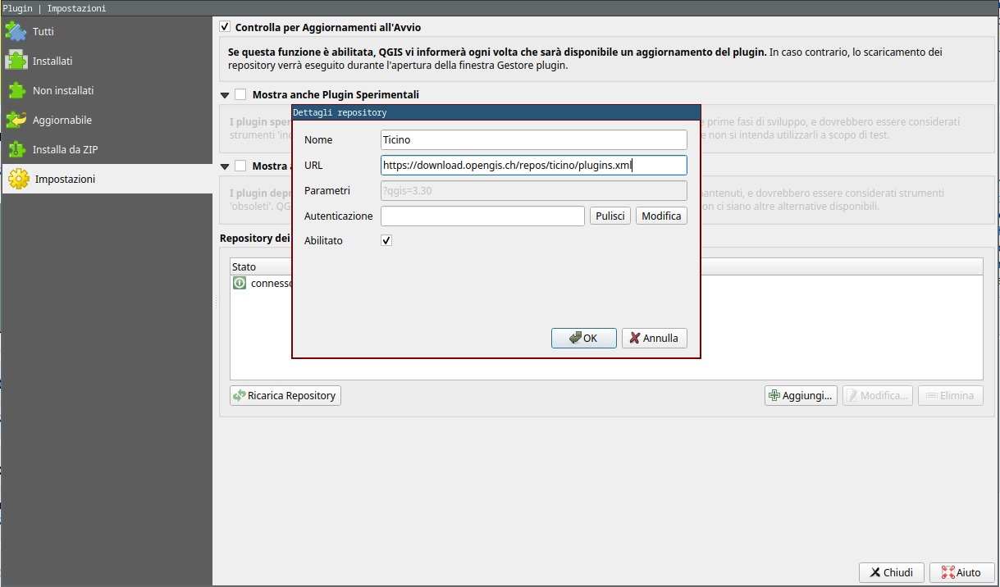
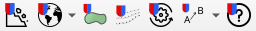
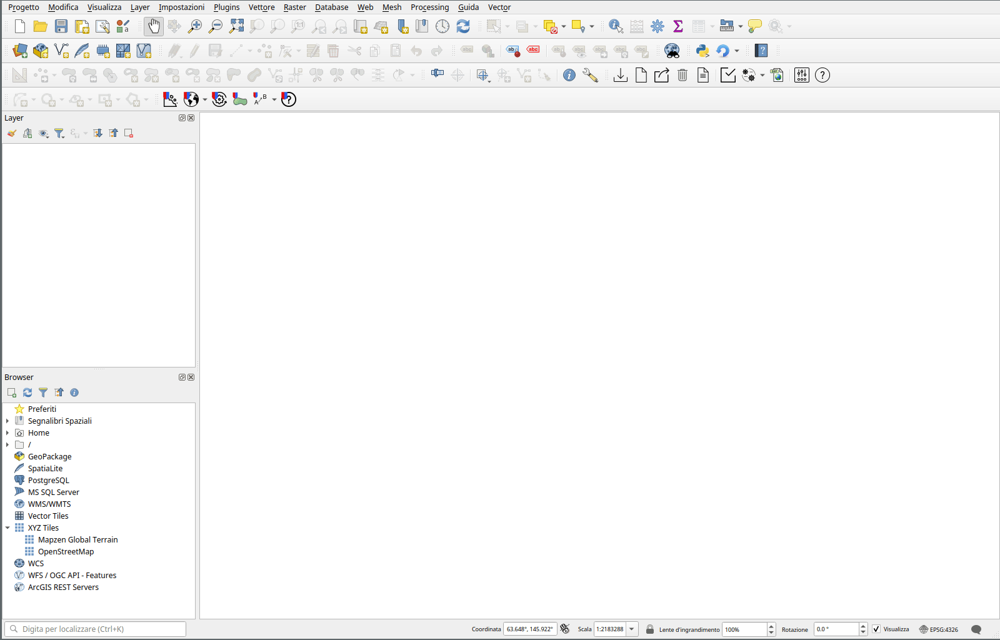
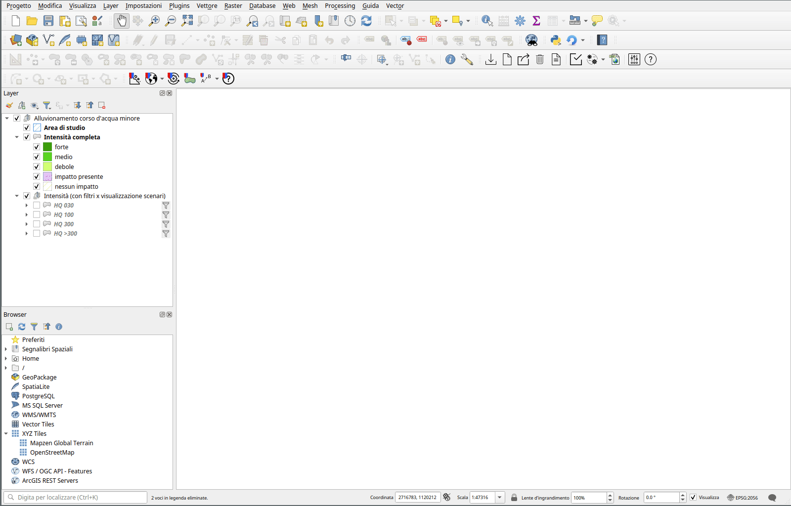
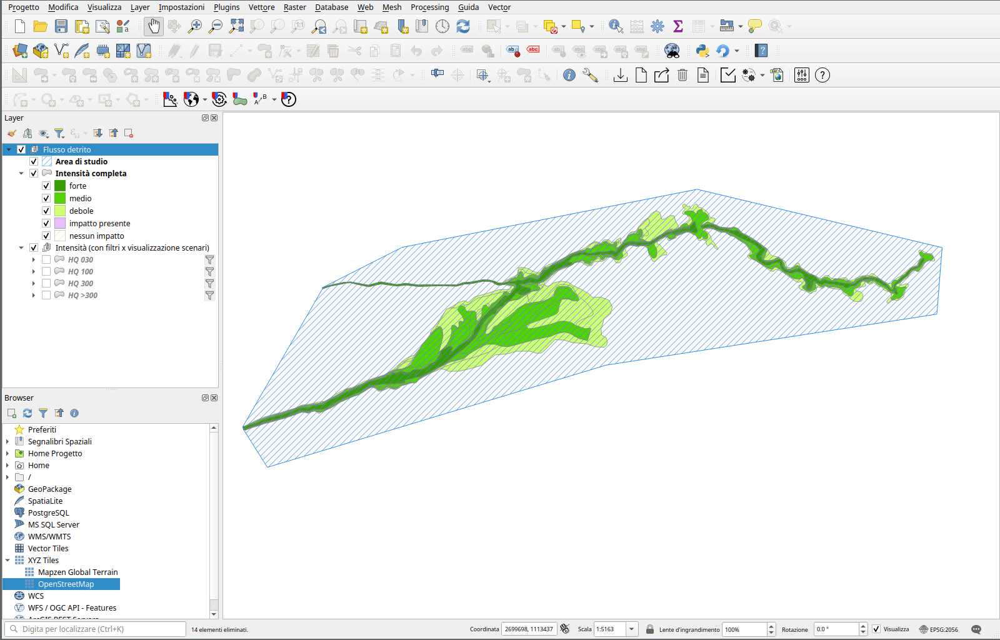
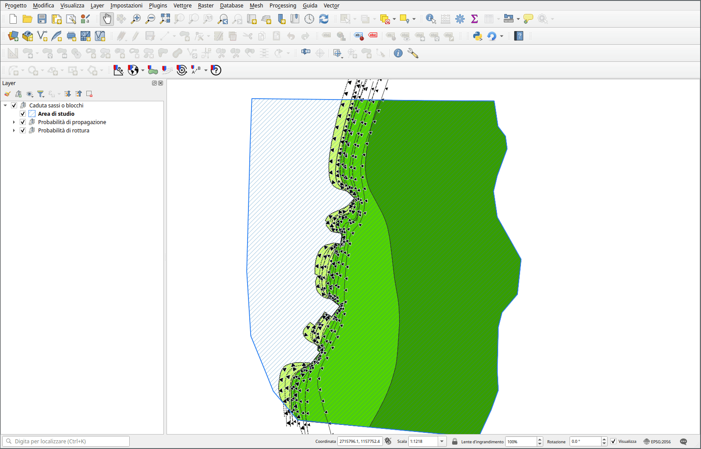
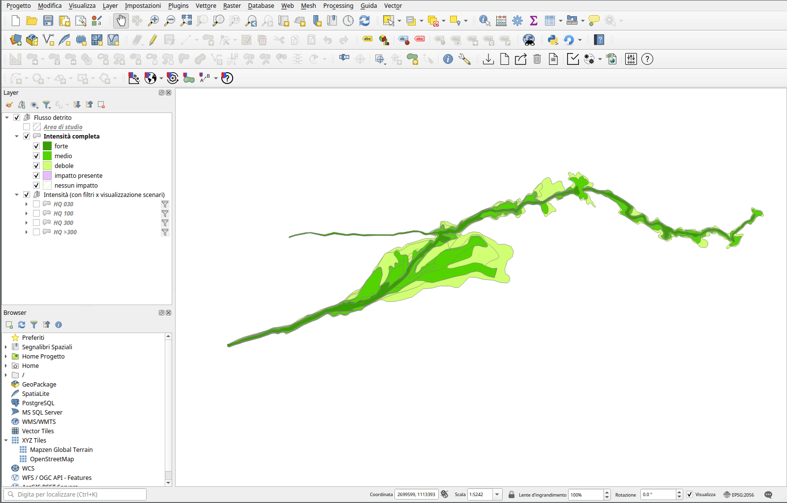
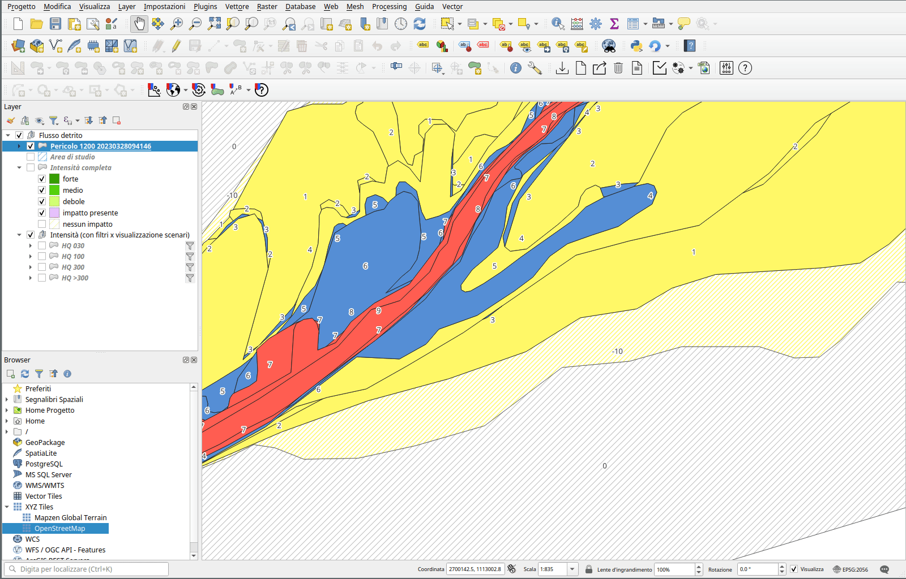

# Plugin


## Installazione

Per installare il plugin in QGIS è necessario aggiungere un nuovo
repository dei plugin in QGIS:

È possibile aggiungere il repository andando nel menu *Plugins -> Gestisci ed Installa Plugin...*



```
https://download.opengis.ch/repos/ticino/plugins.xml
```

A questo punto è possibile installare il plugin chiamato `pzp`.

!!! Nota
    Richiede QGIS 3.16 o superiore


## Funzionalità

Le funzionalità del plugin sono accessibili tramite la toolbar del plugin.



In particolare tramite la toolbar è possibile:

- aggiungere un nuovo processo con i relativi layer al progetto QGIS attuale
- aggiungere dei layer con dati di base o mappe di base
- eseguire il calcolo delle zone di nessun impatto
- generare il layer con le intensità tramite linee di propagazione
- eseguire il calcolo delle zone di pericolo
- modificare il valore delle zone di pericolo che hanno possibilità multiple
- consultare questo manuale online

### Aggiunta dei layer per la registrazione di un processo al progetto QGIS

Tramite il pulsante "Aggiuni proceso" è possible aggiungere al
progetto QGIS attuale un nuovo gruppo contenente i layer per
digitalizzare le intensità.

Viene chiesto il percorso di una directory in cui salvare i dati (in
formato GeoPackage) e il tipo di processo da aggiungere. Il processo
che viene aggiunto consiste in un gruppo di layer. I layer variano a
dipendenza del tipo di processo.



### Aggiunta di layer con dati o mappe di base

Tramite i pulsanti "Aggiungi mappa base" e "Aggiungi dati base" è
possibile aggiungere al progetto QGIS attuale i layer contenenti le
mappe di base o i layer di base.



### Digitalizzazione delle geometrie e layer

La digitalizzazione delle geometrie avviene tramite i normali strumenti di QGIS.

#### Area di studio

Questo layer permette di digitalizzare le aree di studio. Per ogni area di
studio va definita una fonte del processo. La definizione delle aree di
studio è necessaria per poter procedere con la digitalizzazione delle
intensità.

#### Intensità

Questo layer permette di digitalizzare le intensità. Attributi necessari sono:

- il periodo di ritorno (in anni)
- l'intensità
- il processo rappresentato (viene impostato automaticamente in base al processo selezionato al momento della creazione)
- la fonte del processo (in relazione con le fonti di processo definite nelle aree di studio)

#### Probabilità di propagazione

Questo layer permette di digitalizzare le linee che definiscono le probabilità di propagazione. Attributi necessari sono:

- probabilità di propagazione
- fonte del processo
- probabilità di rottura (a cui la linea si riferisce)

!!! Nota
    Questo layer è presente solamente per il processo "Caduta sassi/blocchi/massi"

#### Probabilità di rottura

Questo layer permette di digitalizzare le geometrie che definiscono le probabilità di rottura. Attributi necessari sono:

- probabilià di rottura
- intensità
- fonte del processo

!!! Nota
    Questo layer è presente solamente per il processo "Caduta sassi/blocchi/massi"

### Calcolo delle zone di nessun impatto



Tramite il pulsante "Calcolo delle zone di nessun impatto" è possibile generare le geometrie delle zone con nessun
impatto, per fonte di processo, all'interno delle aree di studio. In
pratica, per ogni area di studio, viene creata una geometria con
intensità "nessun impatto" corrispondente a tutta la superficie
dell'area di studio non coperta da altre geometrie della fonte di
proceso in questione.

!!! Nota
    Per poter utilizzare questo pulsante occorre selezionare il gruppo contentente il processo nel pannello dei layer di QGIS

### Generazione delle intensità tramite le linee di propagazione



Tramite il pulsante "Calcola propagazione" è possibile generare il
layer delle intensità partendo dai layer con le probabilità di rottura
e da quello con le linee di propagazione, per il processo di caduta
sassi o blocchi.

Il layer generato può venir utilizzato per procedere al calcolo delle
zone di pericolo, come per gli altri tipi di processo.

### Calcolo delle zone di pericolo



Tramite questo pulsante "Calcolo delle zone di pericolo" è possibile generare un layer con le zone di pericolo.
Viene generato un nuovo layer ogni volta che viene premuto il
pulsante. Il nome del layer include il codice del processo, la data e
l'ora di creazione. Il layer viene salvato nello stesso geopackage
utilizzato dal processo in questione.

!!! Nota
    Per poter utilizzare questo pulsante occorre selezionare il gruppo contentente il processo nel pannello dei layer di QGIS

### Modifica delle zone con possibilità multiple



Questo strumento permette di modificare il colore delle zone di
pericolo che secondo la matrice possono avere più possibilità. Ad
esempio per la matrice del *Flusso di detrito*, il pericolo 4 può
essere giallo (4a) o blu (4b).

Premendo il pulsante "A->B", tutte le geometrie selezionate nel layer
che hanno più possibilità diventeranno "B" e premendo il pulsante
"B->A", diventeranno "A". Se nessuna geometria è selezionata nel
layer, l'operazione viene eseguita su tutte le geometrie del layer con possibilità multipla.

!!! Nota
    Per poter utilizzare questo pulsante occorre selezionare il layer con le zone di pericolo sul quale si vuole eseguire l'operazione

### Ottenere informazioni Alla pagina https://opengisch.github.io/pzp/
è presente la documentazione aggiornata. La pagina è accessibile
tramite il pulsante "Aiuto" nel plugin.
