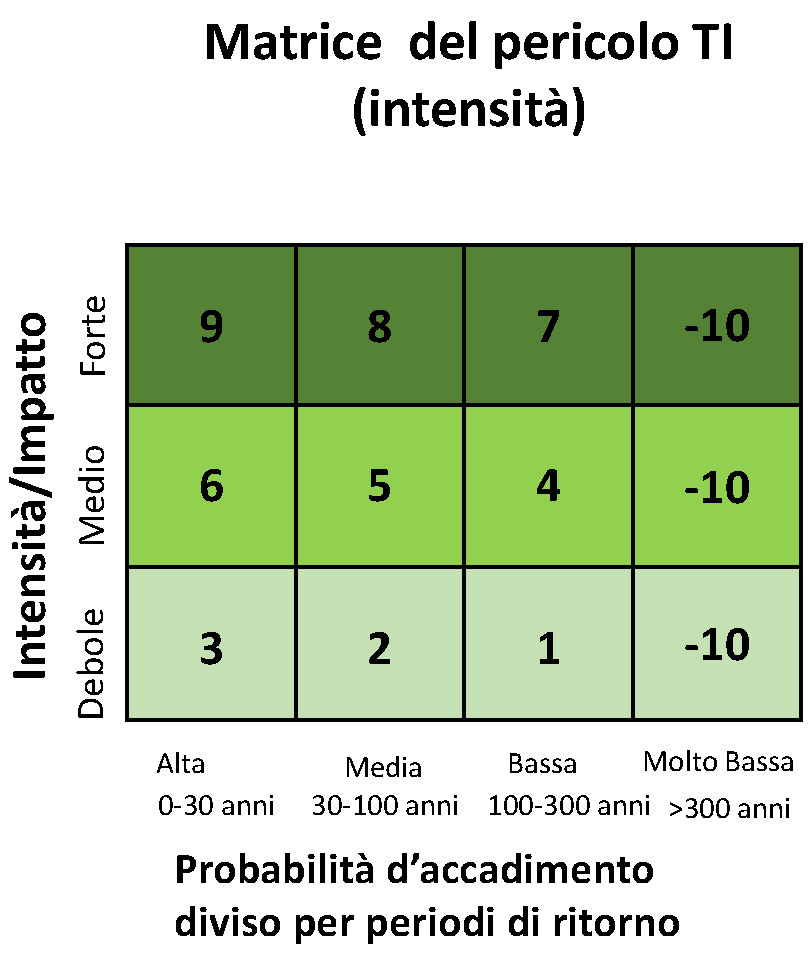
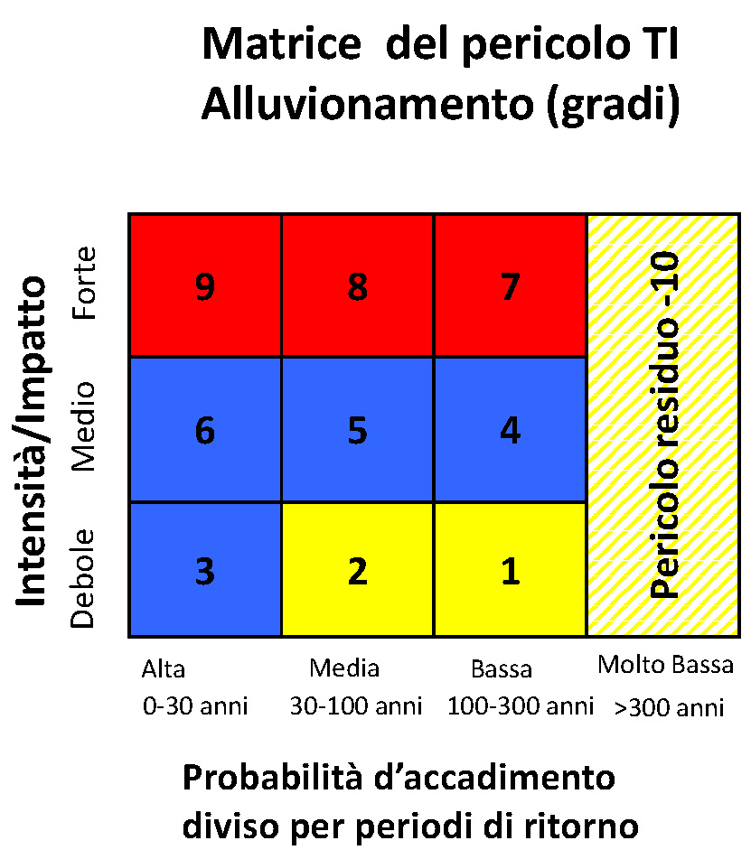
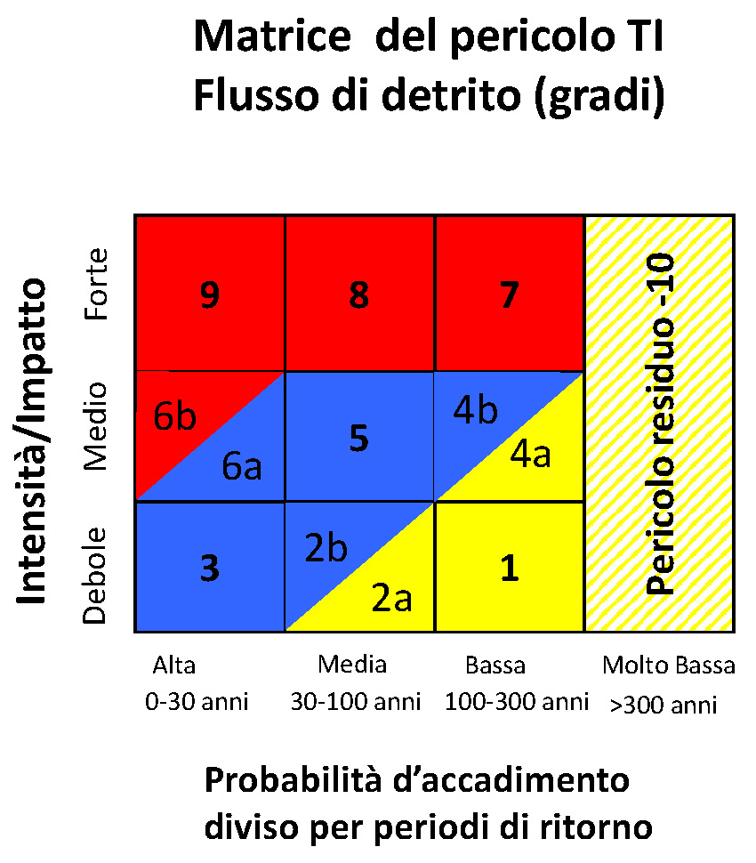
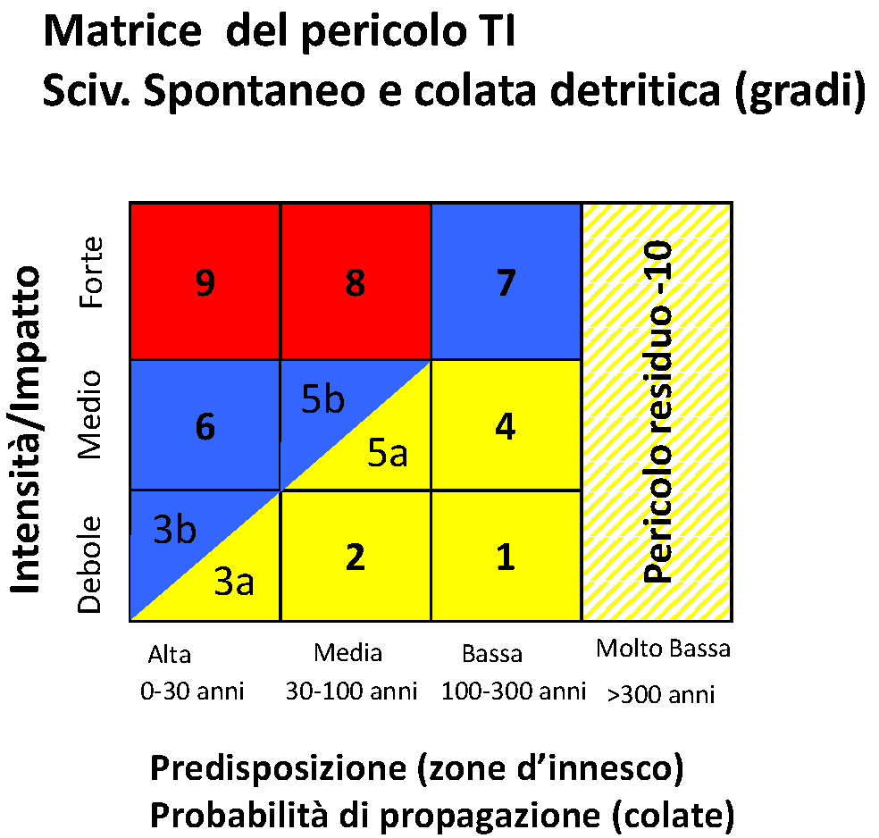
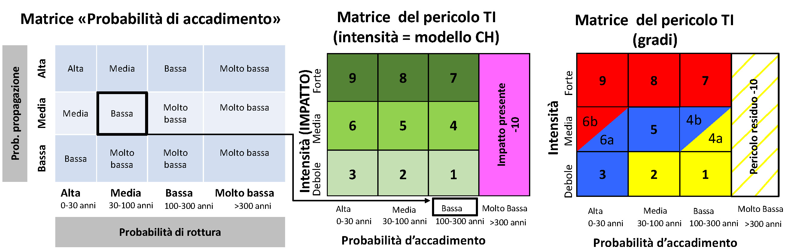
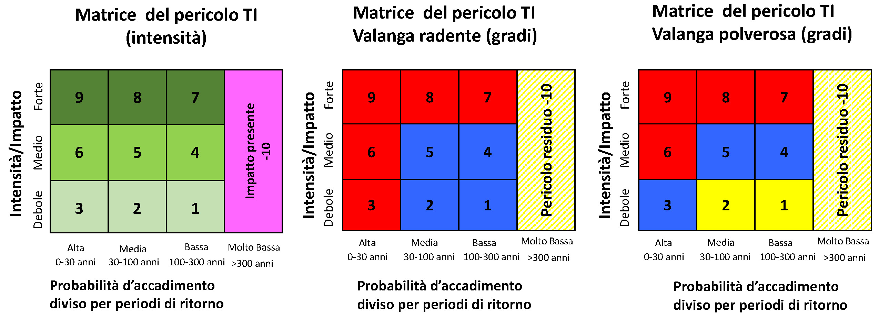

# Reference

## Versioni

| Versione | Data pubblicazione | Descrizione                                                                    |
|----------|--------------------|--------------------------------------------------------------------------------|
| 1.2.4    | 16.06.2023         | Utilizza algoritmo fondi per area                                              |
| 1.2.3    | 07.06.2023         | Miglioramento simbologia                                                       |
| 1.2.2    | 31.05.2023         | Aggiornamento mappe di base e dati di base                                     |
| 1.2.1    | 31.05.2023         | Aggiornamento mappe di base e dati di base                                     |
| 1.2.0    | 25.05.2023         | Calcola propagazione per fonte di processo                                     |
| 1.1.7    | 23.05.2023         | Correzione errore A->B e miglioramento stili e documentazione                  |
| 1.1.6    | 16.05.2023         | Migliora gli stili dei layer                                                   |
| 1.1.5    | 16.05.2023         | Correzione e miglioramenti degli algoritmi                                     |
| 1.1.4    | 10.05.2023         | Migliora gli stili dei layer                                                   |
| 1.1.3    | 05.05.2023         | Crea layer filtrati per layer intensità generato da algoritmo propagazione     |
| 1.1.2    | 05.05.2023         | Migliora algoritmo propagazione e migliora gestione errori                     |
| 1.1.1    | 03.05.2023         | Migliora la gestione delle variabili dei layer                                 |
| 1.1.0    | 03.05.2023         | Aggiungi layer filtrati per processo caduta sassi                              |
| 1.0.9    | 28.04.2023         | Migliora le icone                                                              |
| 1.0.8    | 28.04.2023         | Migliora i vincoli nei form                                                    |
| 1.0.7    | 27.04.2023         | Creazione separata layer propagazione                                          |
| 1.0.6    | 21.04.2023         | Permetti gli apici nel nome delle fonti di processo anche per algo no_impact   |
| 1.0.5    | 21.04.2023         | Permetti gli apici nel nome delle fonti di processo                            |
| 1.0.4    | 20.04.2023         | Miglioramento degli stili dei layer                                            |
| 1.0.3    | 18.04.2023         | Utilizza il codice del valore della matrice (es. 1003) invece del valore reale |
| 1.0.2    | 05.04.2023         | Miglioramento algoritmo calcolo zone di pericolo                               |
| 1.0.1    | 04.04.2023         | Miglioramento compatibilità stili e algoritmi in QGIS 3.16                     |
| 1.0.0    | 31.03.2023         | Prima release pubblica                                                         |

## Matrici del pericolo utilizzate

### Matrice intensità

### Alluvionamento

### Flusso di detriti

### Scivolamento spontaneo e colata detritica di versante

### Caduta sassi/blocchi/massi

### Valanga radente e valanga polverosa

## Codici domini

### Probabilità di evento

| Codice | Descrizione |
|--------|-------------|
| 1000   | Molto bassa |
| 1001   | Bassa       |
| 1002   | Media       |
| 1003   | Alta        |

### Intensità

| Codice | Descrizione      |
|--------|------------------|
| 1000   | Nessun impatto   |
| 1001   | Impatto presente |
| 1002   | Debole           |
| 1003   | Medio            |
| 1004   | Forte            |

### Pericolo

| Codice | Descrizione      |
|--------|------------------|
| 1000   | Non in pericolo  |
| 1001   | Pericolo residuo |
| 1002   | Basso            |
| 1003   | Medio            |
| 1004   | Elevato          |

### Tipo di processo

| Codice | Descrizione                             |
|--------|-----------------------------------------|
| 1110   | Alluvionamento corso d'acqua minore     |
| 1120   | Alluvionamento corso d'acqua principale |
| 1200   | Flusso detrito                          |
| 1400   | Ruscellamento superficiale              |
| 2001   | Scivolamento spontaneo                  |
| 2002   | Colata detritica di versante            |
| 3000   | Caduta sassi o blocchi                  |
| 4100   | Valanga radente                         |
| 4200   | Valanga polverosa                       |

## Variabili dei layer
I layer generati dal plugin hanno le seguenti variabili definite:

| Variabile   | Descrizione                              |
|-------------|------------------------------------------|
| pzp_layer   | tipo di layer (es. intensity)            |
| pzp_process | codice del processo del layer (es. 1110) |
