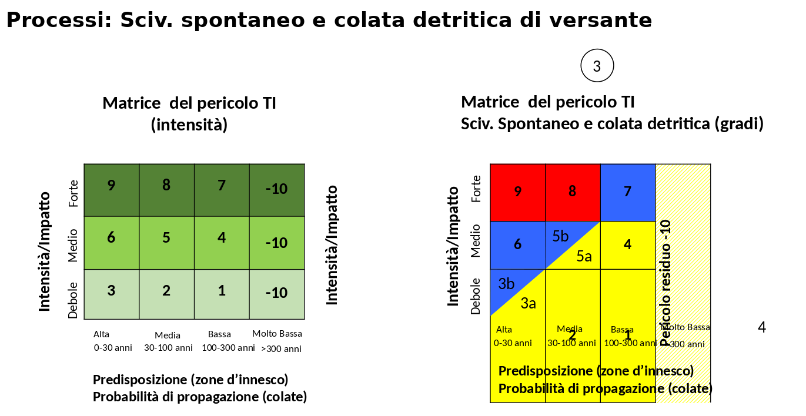
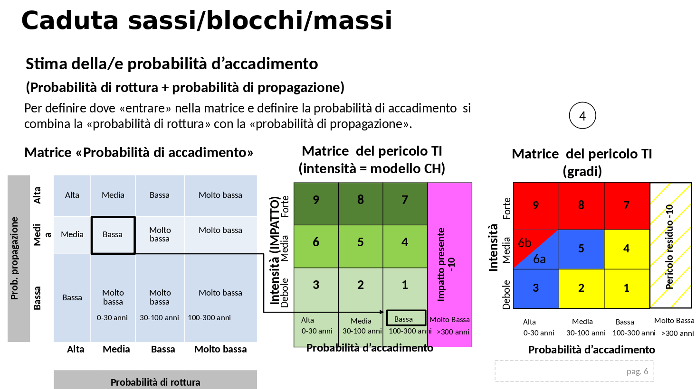
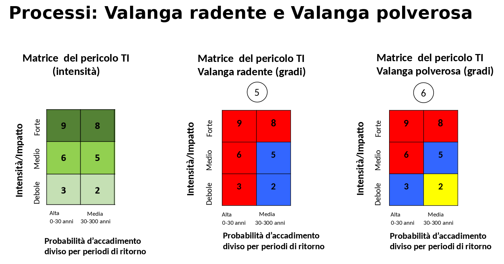

# Reference

## Matrici del pericolo utilizzate

### Flusso di detrito e alluvionamento

### Scivolamento spontaneo e colata detritica di versante

### Caduta sassi/blocchi/massi

### Valanga radente e valanga polverosa

## Codici domini

### Probabilità di evento

| Codice | Descrizione |
|--------|-------------|
| 1000   | Molto bassa |
| 1001   | Bassa       |
| 1002   | Media       |
| 1003   | Alta        |

### Intensità

| Codice | Descrizione      |
|--------|------------------|
| 1000   | Nessun impatto   |
| 1001   | Impatto presente |
| 1002   | Debole           |
| 1003   | Medio            |
| 1004   | Forte            |

### Pericolo

| Codice | Descrizione      |
|--------|------------------|
| 1000   | Non in pericolo  |
| 1001   | Pericolo residuo |
| 1002   | Basso            |
| 1003   | Medio            |
| 1004   | Elevato          |

### Tipo di processo

| Codice | Descrizione                             |
|--------|-----------------------------------------|
| 1110   | Alluvionamento corso d'acqua minore     |
| 1120   | Alluvionamento corso d'acqua principale |
| 1200   | Flusso detrito                          |
| 1400   | Ruscellamento superficiale              |
| 2001   | Scivolamento spontaneo                  |
| 2002   | Colata detritica di versante            |
| 3000   | Caduta sassi o blocchi                  |
| 4100   | Valanga radente                         |
| 4200   | Valanga polverosa                       |

## Versioni

| Versione | Data pubblicazione | Descizione |
|----------|--------------------|------------|
|          |                    |            |
